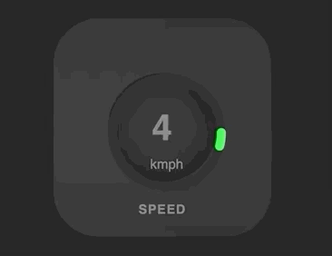
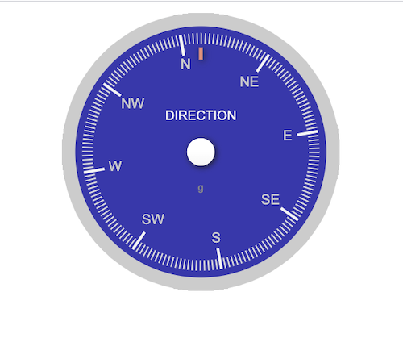

## List HTML CSS examples for quick demos and prototypes

1. Clone this repo
2. cd examples

## Example List

#### Radial Dial ( examples/radial_dial_dynamic_values_calc/ )

#### Neon Button ( examples/neon_button_js_control/ )

#### Analog Compass with string ( examples/analog_compass_1 )

#### Analog Compass with numbers ( examples/analog_compass_2 )

#### CSS Grids with Ruler ( examples/css_grid_with_screen_size_ruler )

#### 3x3 CSS Responsive Grids ( examples/css_grids_3x3 )

#### CSS grid and radial dials ( examples/css_grid_n_radial_dials_v1 )

#### Radial Dial Type 2 ( examples/radial_dial_type2 )

#### Circular Counter  ( examples/css_circular_counter )

#### Volume Slider  ( examples/css_volume_slider )

#### Responsive Navbar ( examples/navbar_4 )

#### Responsive Navbar ( examples/navbar_8 )

